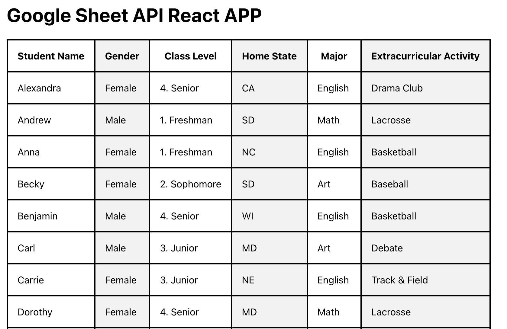

# Google-sheet-React-App

### Steps to run the code:

1. clone the code
   `git clone "url"`
2. Replace the Access token and Sheet id used in the code by your personal Access token and Sheet id.
   Note: Use this [Link](https://developers.google.com/oauthplayground/?code=4/0AWtgzh7jzDJSlKWiXXtEZl8qfXo-aGi3eWDALlkqg6pseayvMZrV04K1ZmoLVCeqIgy8cw&scope=https://www.googleapis.com/auth/spreadsheets) for getting Access token.
3. Go into the cloned dir using CLI and perform following commands to install dependencies and start:
   `npm install`
   `npm start`
4. Web app will open at

Sample output

